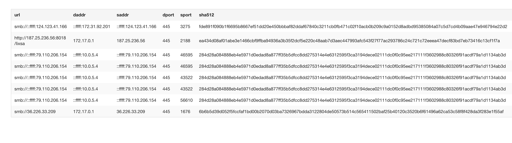

# Project 9 - Honeypot

Time spent: **6** hours spent in total

## Honeypots deployed
In total, 56 honeypots where deployed using 42 virtual machines across 4 hosting providers. The breakdown of honeypot types deployed was:

Count | Honeypot Type
----- | ----------------
20 | Cowrie
11 | Conpot
19 | Dionaea
2 | ElasticHoney
1 | Snort
1 | Suricata
1 | up0f
1 | wordpot

Instances running Conpot, ElasticHoney, and Wordpot had Cowrie added mid-way through data collection (as it was determined they could function together). 

Instances were split across these hosting providers:

Count | Hosting Provider
----- | ----------------
16 | Azure
11 | Digital Ocean
8 | Linode
7 | AWS

and were allocated across these countries:

Count | Country
----- | ----------------
19 | United States
5 | South Korea
3 | France
3 | Germany
2 | Europe (unspecified)
2 | India
2 | Japan
2 | Singapore
2 | United Kingdom
1 | Australia
1 | Brazil
1 | Canada
1 | Ireland

Instances were added over the course of a week, with some operating nearly a full week while others only operating a few days. 

## Issues encountered

There weren't any major issue encountered. I didn't use Google Cloud Platform because I didn't have any free credit available (and my school account did not work). 

## Data summary

There's a lot to analyze within this dataset, but here are some very basic observations:

** Number of Attacks **
A total of 1,124,413 attacks were logged. Broken down by honeypot the attack counts are:

Count | Honeypot
----- | --------
984,227 | dionaea
102,091 | cowrie
16,225 | p0f
9,076 | suricata
7,895 | conpot
4,876 | snort
22 | elastichoney
0 | wordpot

Over a 24-hour sample, nearly 70% of attacks came from addresses in the United States, with around 20% originating from Russian addresses.

Dionaea captured 8 samples of malware, signatures shown below:

## Unresolved questions 
It is unclear why there were no attacks on the wordpot instance. Visiting the instance did show the honeypot Wordpress site, but I did not attempt an attack. It's possible there was a configuration problem. 

## Data Export
The data collected is available in the [data](./data/) directory of this repository. The files included are:

* **instances.csv** - a CSV export detailing the hosting provider and data center location for each honeypot instance deployed.
* **sensors.csv** - a CSV export of the data MHN keeps linking host identifiers to IP addresses.
* **session_2018102900.json.zip** - a zip file of the file exported by mongoexport. (NOTE: zipped file uploaded, as original was ~411 MB)
